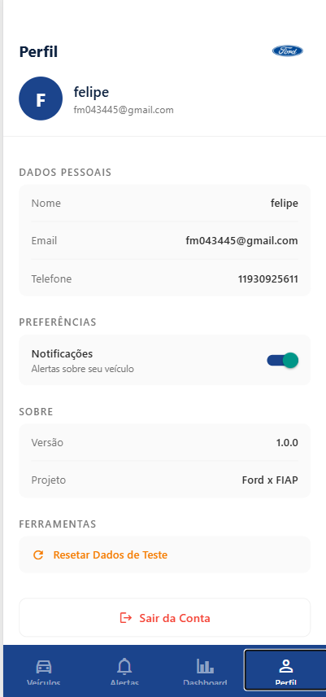
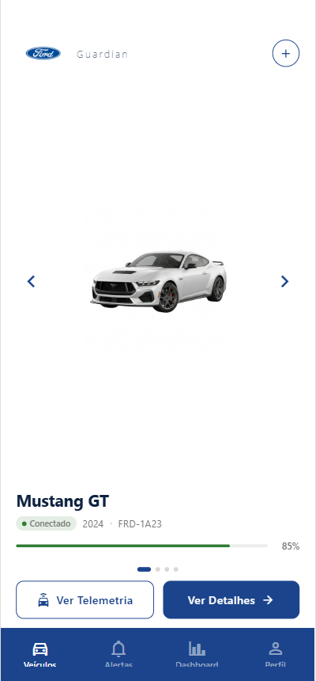
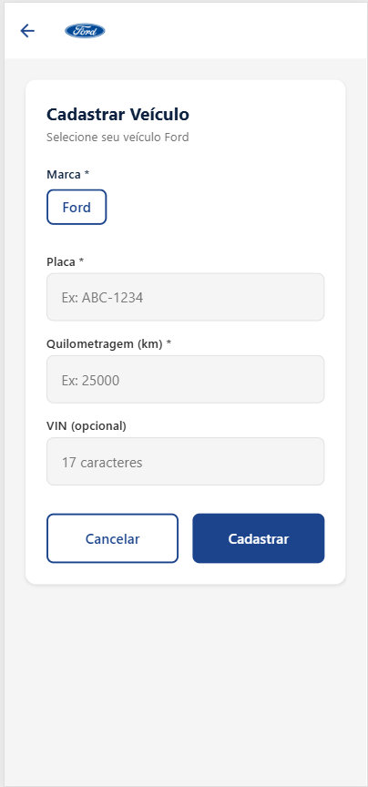
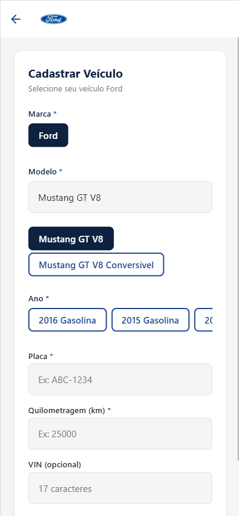
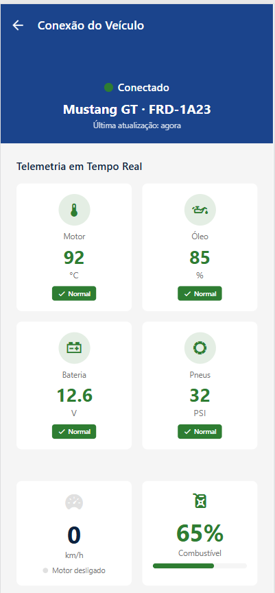
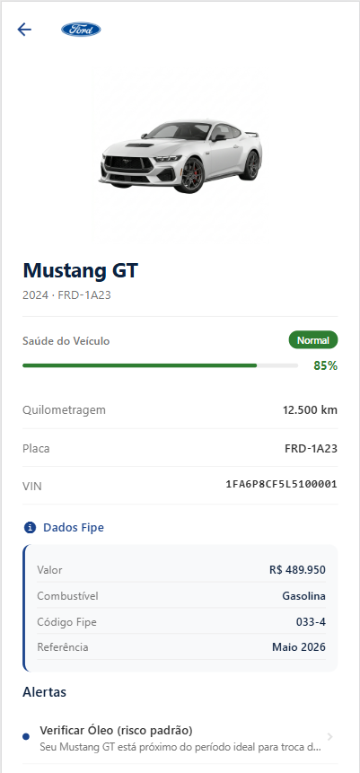
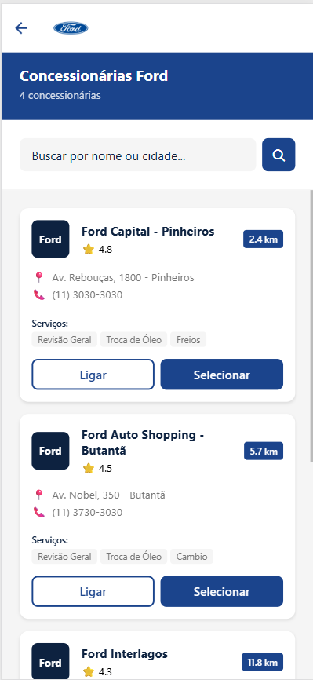
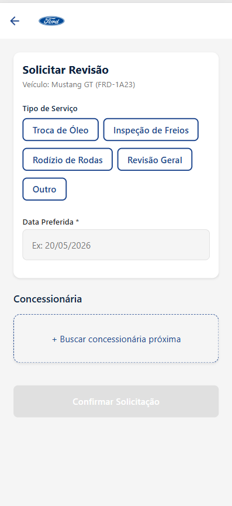
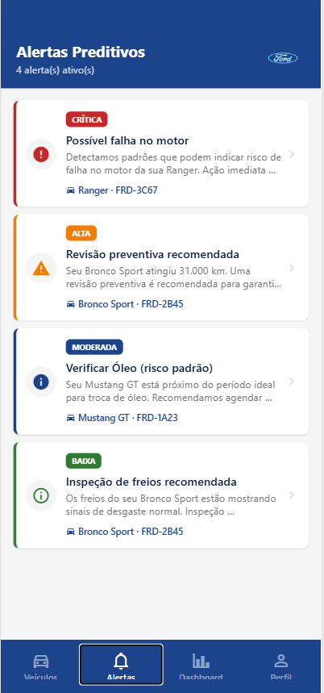
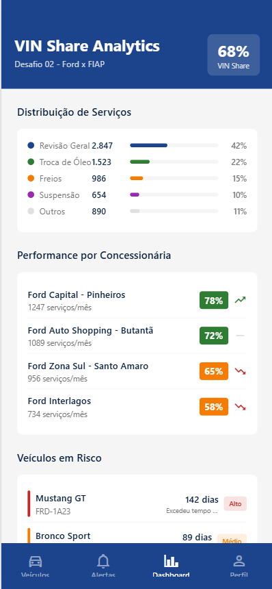

# Ford Guardian - Sprint Mobile

**Repositório da Sprint de Mobile Development & IoT - Ford x FIAP**

## Desafio 02 — Impulsionando o VIN Share na América do Sul com Soluções Inteligentes

---

## Screenshots do App






















---

## Funcionalidades

| Funcionalidade | Descrição |
|----------------|-----------|
| **Fipe API** | Busca de veículos por marca/modelo/ano com dados reais de preço e especificações |
| **Nominatim Geolocation** | Cálculo de distâncias reais até concessionárias |
| **Firebase Service** | Estrutura para persistência em nuvem (configurável) |
| **Persistência Local** | AsyncStorage para veículos, alertas, preferências |
| **Status de Saúde** | Normal (verde), Atenção (laranja), Crítico (vermelho) |
| **Alertas Preditivos** | Ordenados por severidade com ícones visuais |
| **Dashboard Analytics** | Métricas de VIN Share, performance de concessionárias |
| **Animação de Sucesso** | Feedback visual ao cadastrar veículo |
| **Pull-to-Refresh** | Atualização de listas |
| **Carrossel de Veículos** | Navegação entre múltiplos veículos com swipe |

---

## Stack Tecnológica

| Tecnologia | Uso |
|------------|-----|
| **React Native + Expo SDK 54** | Framework principal |
| **TypeScript** | Linguagem tipada |
| **@react-navigation/native 7.x** | Navegação stack + tabs |
| **@react-native-async-storage/async-storage** | Persistência local |
| **React Native Reanimated** | Animações suaves |
| **@expo/vector-icons** | Ícones Material Community |
| **Clean Architecture** | Presentation / Domain / Data / Infrastructure / Shared |

---

## Estrutura do Projeto

```
fiap-mdi-sprint-ford-guardian/
├── FordGuardian/
│   ├── src/
│   │   ├── presentation/
│   │   │   ├── screens/        # 12 telas do app
│   │   │   ├── components/    # 13 componentes reutilizáveis
│   │   │   └── navigation/     # AppNavigator (Stack + Tabs)
│   │   ├── domain/
│   │   │   └── entities/      # User, Vehicle, Alert, Dealer, FipeDetails
│   │   ├── data/
│   │   │   ├── repositories/   # VehicleRepository, AlertRepository, UserRepository
│   │   │   └── mocks/          # Dados mockados (users, vehicles, alerts, dealers)
│   │   ├── infrastructure/
│   │   │   ├── api/            # fipeApi, nominatimApi, firebaseService
│   │   │   └── storage/        # AsyncStorage Service
│   │   └── shared/
│   │       ├── theme/           # Cores, tipografia, espaçamento
│   │       └── constants/        # Rotas e configuração de imagens
│   ├── App.tsx
│   ├── app.json
│   └── package.json
├── assets/                     # Imagens do README (screenshots)
└── README.md                   # Este arquivo
```

---

## Screens (12 Telas)

| Screen | Descrição |
|--------|-----------|
| `SplashScreen` | Tela de abertura com logo Ford |
| `OnboardingScreen` | Tutorial de 3 passos |
| `LoginScreen` | Autenticação de usuário |
| `RegisterScreen` | Cadastro de novo usuário |
| `HomeScreen` | Lista de veículos com carousel |
| `VehicleDetailsScreen` | Detalhes completos do veículo |
| `AddVehicleScreen` | Cadastro de novo veículo (Fipe API) |
| `AlertsScreen` | Lista de alertas por severidade |
| `DashboardScreen` | Métricas e analytics de VIN Share |
| `FindDealerScreen` | Busca de concessionárias próximas |
| `ProfileScreen` | Perfil do usuário e preferências |
| `CarConnectionScreen` | Telemetria e dados simulados |
| `RequestReviewScreen` | Solicitação de revisão na concessionária |

---

## APIs Integradas

### Fipe API (Brasil)
- **Endpoint:** `https://parallelum.com.br/fipe/api/v1/carros`
- **Uso:** Busca de marcas, modelos, anos e valores Fipe

### Nominatim/OSM
- **Endpoint:** `https://nominatim.openstreetmap.org`
- **Uso:** Geocodificação e cálculo de distâncias

### Firebase Firestore
- **Status:** Configurado (requer credenciais)
- **Fallback:** AsyncStorage se Firebase não configurado

---

## Como Executar

```bash
# Entrar no diretório do app
cd FordGuardian

# Instalar dependências
npm install

# Rodar com Expo
npx expo start

# Ou para Android/iOS específico
npx expo start --android
npx expo start --ios
```

---

## Credenciais de Teste

| Email | Senha | Role |
|-------|----------|------|
| felipe@example.com | 123456 | user |
| admin@ford.com | Admin@123 | admin |

---

## Equipe

| Nome | RM |
|------|-----|
| Felipe Marques | 556319 |
| Gabriel Barros Cisoto | 556309 |

---

## Decisões Técnicas

1. **Clean Architecture** - Separação clara de responsabilidades (Presentation/Domain/Data/Infrastructure)
2. **Fipe API** - Dados reais do mercado brasileiro para valuation de veículos
3. **Nominatim** - Geolocalização sem custo para cálculo de distâncias
4. **AsyncStorage** - Persistência simples e eficiente sem necessidade de backend
5. **Mock Data** - Concessionárias e alertas pré-definidos para demonstração offline
6. **Reanimated** - Animações nativas performáticas para feedback visual

---

**Sprint:** Mobile Development & IoT - Ford x FIAP 2026
**Challenge:** Ford x FIAP - Impulsionando o VIN Share
**Entrega:** 24/05/2026

#KeepCoding #ReactNative #FIAP #FordGuardian